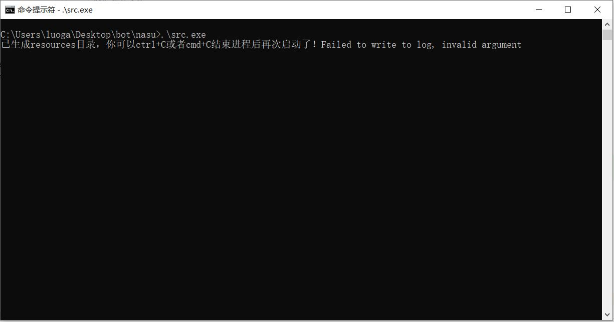

# Nasu: 面向个人的NAS平台

 </div>

[](https://goreportcard.com/report/github.com/littlebutt/nasu)  

Nasu是一款面向个人的NAS平台，其目的是“一次部署，随时存储”。用户只要部署一次就可以像浏览网页一样上传和预览文件内容。和传统的网盘相比，其优点有一下几个方面：

- 安全：文件存储在网上可以做数据备份，而且不会因为审核丢失数据
- 高效：文件的上传下载完全依赖于网络环境，不会限流限速
- 便宜：自己部署的NAS平台，没有会员机制，成本只是服务器的成本

## 安装

### 下载安装

可以直接在右侧release页面选择适合自己操作系统的二进制可执行文件，直接在控制台运行即可

### 编译安装

由于Nasu是Golang编写的，需要提前准备好相应的环境。

首先，克隆仓库到本地

```shell
git clone https://github.com/littlebutt/nasu.git
```

然后进入目录下载依赖并编译程序

```shell
cd nasu
go mod download
go build nasu/src
```

### Docker安装

```shell
docker build -t nasu .
```

## 运行

首先在运行之前需要安装好sqlite3，并配置好环境变量。

然后直接在命令行中运行下载好的二进制可执行文件，第一次运行会生成resources目录，如下图所示：



这时候按 `CTRL+C` 或 `cmd+c` 停止运行。再次运行二进制可执行文件即可正确运行。


该二进制可执行文件还可以配合参数使用，具体如下；

```text

-p  --port  指定运行的端口，默认8080
-h  --host  指定运行的host，默认localhost。用处不大，因为只能支持本地运行
-d  --debug 指定DEBUG模式运行，会打印DEBUG相关日志，一般用于排查  
```

## 使用

（未完待续。。。）


